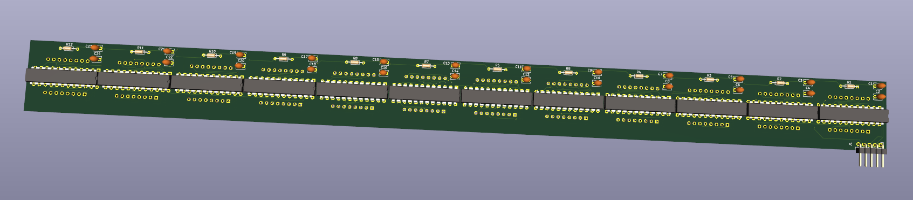

# Full Size PCB Schematics and Gerber Files

## About the PCB
This PCB is basically 12 single modules connected together as one, using only through hole components to make it easier to hand solder.

*Note: while designed looking up the costs for the parts it is cheaper by far to just connect several premade modules together*

## BOM
* 12 x MAX7219CNG+
* 12 x 10k Resistors
* 12 x 0.1uF Ceramic Capacitors
* 12 x 10uF/25v Ceramic Capacitors
* 12 x TA08-81GWA 8x8 Matrix LED's
* 1 x 5pin Header

